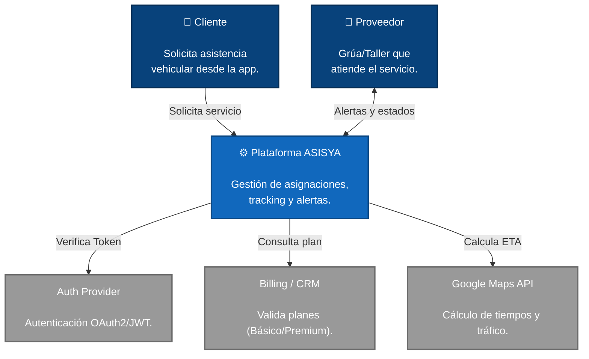
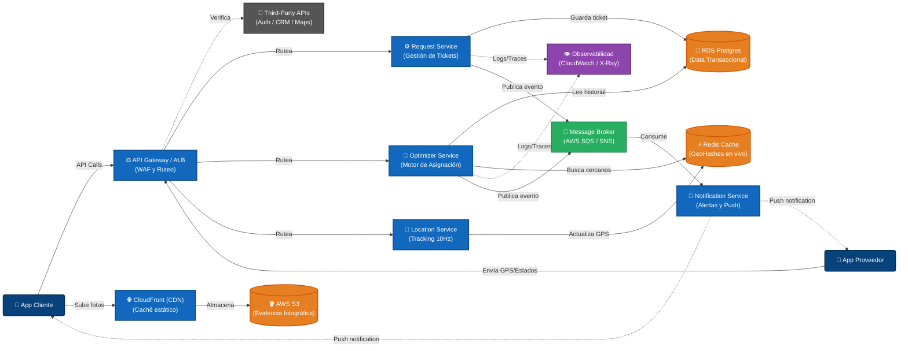
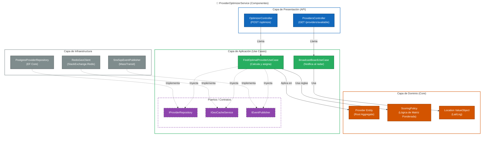

# ENTREGABLE 1: Diseño Arquitectónico - ASISYA

Para este proyecto, he definido una arquitectura de Microservicios apoyada en Clean Architecture y Domain-Driven Design (DDD). Busco garantizar que la plataforma no solo sea escalable, sino que soporte fallos críticos sin comprometer la operación en AWS.

## 1. Visión General del Sistema (C4 Nivel 1)

En este primer nivel, podemos ver el contexto global de ASISYA. Aquí se identifican los actores principales (el cliente que pide ayuda y el proveedor que asiste) y las dependencias directas con los servicios de terceros, como la pasarela de pagos, el proveedor de identidad y los motores de mapas.

## 2. Arquitectura de Contenedores y Nube (C4 Nivel 2)

Para la infraestructura en AWS, decidí separar las responsabilidades en microservicios hiper focalizados. Todo se comunica de forma asíncrona mediante un bus de eventos (Message Broker) para mantener los componentes desacoplados.

## 3. Estructura Interna del Motor de Optimización (C4 Nivel 3)

Me enfoqué en aplicar Clean Architecture de forma estricta para el servicio core de asignación (`ProviderOptimizerService`). Esto me permite asegurar que toda la lógica de negocio (nuestro scoring de variables) quede totalmente aislada y no dependa de la base de datos o de librerías externas.

## 4. Modelado de Microservicios (DDD)

Para garantizar la escalabilidad técnica y de equipo, dividí la plataforma en cuatro Bounded Contexts. A continuación detallo las responsabilidades, entidades del dominio, contratos y eventos de cada uno:

### 4.1 AssistanceRequestService
* **Responsabilidad:** Gestiona el ticket de asistencia. Se encarga del triaje inicial mediante árboles de decisión, verifica el plan del usuario (Básico, Plus, Premium) y asegura la consistencia en la Máquina de Estados del servicio.
* **Entidades (DDD):** `AssistanceTicket` (Aggregate Root), `TimelineEvent` (Log Inmutable).
* **Contratos:** `IAssistanceRepository`, `IBillingClient`.
* **Eventos:** Publica `AssistanceCreatedEvent` y `AssistanceStateChangedEvent`.

### 4.2 ProviderOptimizerService
* **Responsabilidad:**  Inicia la búsqueda con geofencing expansivo y calcula el score ponderando: Distancia, ETA en vivo, Disponibilidad, Rating histórico y Tasa de Aceptación. 
* **Lógica de Asignación:** Lanza un "Ping Directo" al mejor proveedor por 45 segundos. Si declina, activa el "Tablero de Zona (Board)" para los siguientes 5 proveedores bajo el modelo *First-come, first-served*.
* **Entidades (DDD):** `OptimizationTicket` (Aggregate Root), `ProviderScoreProfile`, `ScoringPolicy` (Domain Service).
* **Contratos:** `IProviderRepository`, `IGeoCacheService`, `IEventPublisher`.
* **Eventos:** Publica `ProviderAssignedEvent` y `BoardBroadcastTriggeredEvent`.

### 4.3 LocationService
* **Responsabilidad:** Servicio ligero enfocado en tracking. Ingesta posiciones GPS de los proveedores a alta frecuencia (10Hz) y permite búsquedas geoespaciales ultrarrápidas.
* **Entidades (DDD):** `ProviderTracer` (Aggregate Root), `GeoPoint` (Value Object).
* **Contratos:** `IRedisLocationRepository`.
* **Eventos:** No publica, solo actualiza la caché efímera.

### 4.4 NotificationsService
* **Responsabilidad:** Encargado del despacho hacia afuera (Push, SMS, WebSockets) para alertas a dispositivos móviles, sin bloquear el flujo transaccional.
* **Entidades (DDD):** `PushNotification` (Aggregate Root), `DeliveryReceipt`.
* **Contratos:** `IPushNotificationProvider`.
* **Eventos:** Es netamente consumidor (Subscriber) de los eventos de asignación y estado.

## 5. Estrategia de Escalabilidad e Infraestructura

He diseñado la infraestructura para soportar picos de demanda impredecibles (ej. condiciones climáticas extremas o de alta demanda):

* **Elasticidad (Autoscaling):** Los servicios core corren sobre pods en Kubernetes/ECS. Utilizan métricas de CPU/Memoria para escalar horizontalmente de forma automática.
* **Mensajería Asíncrona (Pub/Sub):** Utilizamos AWS SQS y SNS. Esto permite un procesamiento asincrónico real, evitando que los servicios se bloqueen esperando respuestas HTTP mutuas.
* **Fallback y Retries:** Si una dependencia externa crítica falla (ej. Google Maps API), el API Gateway y los microservicios implementan el patrón *Circuit Breaker* (Polly en .NET) realizando *retries* exponenciales. Si el fallo persiste, se ejecuta un *Fallback* interno usando algoritmos geográficos de línea recta (Haversine) para no detener la operación.
* **Patrón Outbox:** Para evitar la pérdida de eventos transaccionales ante caídas de red, la asignación en DB y la publicación en SQS se graban dentro de la misma transacción ACID de Postgres.

## 6. Estrategia de Seguridad Perimetral y OWASP

La seguridad se maneja en capas para proteger los datos sensibles y el GPS en vivo:

* **Identidad y Acceso (JWT):** El API Gateway recibe el token OAuth2, pero los microservicios lo validan internamente verificando las firmas JWKS (JSON Web Key Set).
* **WAF y Rate Limits:** AWS WAF protege contra inyecciones SQL y ataques XSS (estándares OWASP). Además, el API Gateway implementa *Rate Limiting* (Throttling) estricto para evitar abusos o DDoS en los endpoints públicos.
* **Gestión de Secretos:** Está estrictamente prohibido usar credenciales en el código. AWS Secrets Manager inyecta dinámicamente las cadenas de conexión en tiempo de despliegue.
* **Mínimo Privilegio (IAM Roles):** Cada contenedor tiene un Rol de IAM restringido. El servicio de notificaciones, por ejemplo, no tiene permisos de lectura sobre la base de datos de pagos.
* **Auditoría y Trazabilidad:** Todo cambio de estado genera un log inmutable. La observabilidad se centraliza en AWS CloudWatch y X-Ray para facilitar la auditoría técnica y el rastreo de peticiones distribuidas.