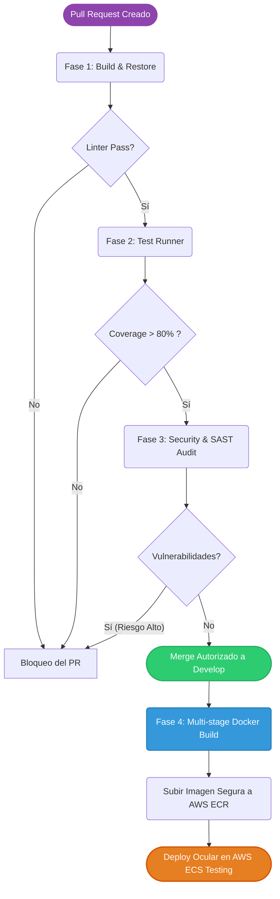

# Manual de Estándares Tecnológicos y Operativos del Squad ASISYA

Este documento establece las normativas, procesos y estándares inquebrantables que rigen el ciclo de vida de desarrollo de software (SDLC) para garantizar la calidad, seguridad y escalabilidad continua de la plataforma ASISYA, estructurando un marco de trabajo altamente predecible y profesional.

---

## 1. Estrategia de Ramas: GitFlow y Definition of Done (DoD)

El equipo emplea estrictamente el modelo **GitFlow**. Queda terminantemente prohibido realizar *commits* directos a las ramas de integración principal.

*   `master` / `main`: Refleja el código en Producción. Es inmutable.
*   `develop`: Punto de integración continua. Refleja el entorno de *Staging/QA*.
*   `feature/*`: Emerge de `develop`. Se utiliza obligatoriamente para desarrollar nuevas características.
*   `release/*`: Emerge de `develop` para congelar el código antes de un despliegue de Producción.
*   `hotfix/*`: Únicamente para resolver bugs críticos en Producción. Emerge directo de `master`.

### Definition of Done (DoD)
Para que un ticket cierre su estado a "Terminado" y la rama sea fusionada, **debe cumplir obligatoriamente los siguientes criterios**:
1.  **Código Compilado:** Cero errores y resolución total de *warnings* detectados por el compilador.
2.  **Pruebas (Coverage):** El código modificado alcanza el umbral mínimo del **80% de cobertura detectado por SonarQube**.
3.  **Code Review Aprobado:** El Pull Request cuenta con un mínimo de **2 aprobaciones (Approvals)** de desarrolladores Pleno/Senior.
4.  **Validación de QA:** El despliegue de la rama superó las pruebas manuales/automatizadas del equipo de QA en `Staging`.
5.  **Documentación:** Los esquemas Swagger o TypeDoc están 100% actualizados si se alteraron contratos.

---

## 2. Convenciones de Codificación Multilenguaje

Nuestra arquitectura es políglota; los estándares visuales exigen cohesión absoluta, como si el código hubiese sido escrito por una sola mente colectiva.

### 2.1. Backend (.NET 8 MVC / Clean Architecture)
*   **Paradigma Riguroso:** Implementación estricta de Inyección de Dependencias, Principios SOLID y segregación mediante CQRS (MediatR).
*   **Enrutamiento Limpio:** Los controladores no contienen lógica de negocio. Únicamente orquestan el comando (`Send`) y manejan el `ActionResult`. Se prohíbe lógica condicional compleja en esta capa.
*   **Contratos:** Es mandatorio el uso de Comentarios XML en los métodos públicos para exponer la documentación visualizada en Swagger.

### 2.2. Frontend (React 18 + TypeScript)
*   **Seguridad de Tipos:** TypeScript opera bajo un esquema restringido. Se prohíbe de forma imperativa el uso del tipo `any`.
*   **Ecosistema React:** Todo componente funcional basa su aislamiento de negocio encapsulando la lógica transaccional o asíncrona dentro de *Custom Hooks*.
*   **Layout:** El empaquetado visual obedece al esquema de diseño Atomic Design (Átomos, Moléculas, Componentes).

### 2.3. Estándar de Contenedores (Docker)
*   **Eficiencia:** El despliegue exige basar las configuraciones en distribuciones **Alpine** ultraligeras.
*   **Multi-Stage:** Todo Dockerfile implementa una separación lógica nativa (`build` vs `final`) asegurando que el SDK de compilación jamás pise la imagen de salida de Producción.

---

## 3. Pilar de Seguridad Global y Manejo de Secretos

La preservación de los datos y la configuración del ecosistema Cloud exige operar bajo la filosofía *Shift-Left Security*.

*   **Cero Tolerancia a Secretos Locales:** El pipeline automatiza la ejecución de un escáner (TruffleHog / GitGuardian). Introducir un archivo `.env` en cualquier rama resulta en rechazo irreversible del commit.
*   **AWS Secrets Manager:** Las credenciales de alto riesgo (Conexiones a Base de Datos, Llaves Maestras JWT, Tokens Geo-APIs) deben inyectarse asincrónicamente mediante el SDK de `AWS Secrets Manager` directo en el arranque (`Program.cs`) y nunca guardarse en el código fuente.

---

## 4. Control Cuantitativo de Deuda Técnica (Rating SQALE)

El ocultamiento del deterioro de código es causal directa de la paralización del producto. La empresa frena la degradación de la madurez del código desde la raíz del planeamiento.

*   **Métricas Estáticas:** El ecosistema restringe subidas basado en las reglas del escáner de **SonarQube**. 
*   **Mantenimiento Rating SQALE 'A':** El Product Owner asigna de manera innegociable el **20% del esfuerzo del Sprint** a remediar deuda técnica detectada. El objetivo primario es mantener permanentemente la métrica de Mantenibilidad SQALE de SonarQube en grado "A". 

---

## 5. Práctica Rigurosa de Pull Requests (Evaluación de Revisores)

El acto de revisar código asume el riesgo total por parte de quien presiona **Approve**. Las revisiones humanas no se detienen en indentaciones (eso le compete al linter automático), el revisor se enfoca en resiliencia de alto nivel.

*   **Anatomía Obligatoria de la Revisión:** Todo QA Senior/Tech Lead evaluará tres frentes cardinales:
    1.  **Integridad de Reglas Matemáticas/Negocio:** Eficiencia del Scoring Matrix o validaciones transaccionales sin pérdida de performance.
    2.  **Manejo de Excepciones:** Validar que los fallos sean controlados, generen `logs` apropiados y devuelvan mensajes amigables sin exponer trazas de servidor.
    3.  **Cumplimiento de Contratos:** Integridad de Entradas/Salidas en DTOs o Interfaces que puedan romper integraciones satélite.
*   **Control Físico de Complejidad Máxima:** Todo Pull Request que exceda las **400 líneas modificadas** debe ser fragmentado o denegado automáticamente, anulando así el riesgo de camuflar *bugs* o generar revisiones psicológicamente exhaustas.

---

## 6. Observabilidad, Monitoreo y Trazabilidad Activa

Implementamos observabilidad industrial para conocer anticipadamente cuándo, dónde y por qué quiebra un cálculo de la matriz. 

*   **Logs Estructurados Obligatorios:** Los clásicos comandos en consola quedan reemplazados en su totalidad por la estructura JSON. Implementaremos `Serilog` inyectado a los sumideros de **AWS CloudWatch**. Nadie captura una excepción en un bloque *try/catch* sin emitir el respectivo error en formato JSON.
*   **TraceId y Trazabilidad Distribuida:** Para evitar la orfandad de los errores asíncronos, las transacciones cruzadas a través del *Gateway* deben arrastrar obligatoriamente un Header `X-Trace-Id`. Este identificador marca el camino absoluto en los índices de logueo.
*   **Dashboards de Salud (Health Checks):** Es mandatorio desplegar tableros de control en Grafana/CloudWatch orientados exclusivamente a medir los picos transaccionales, Error Rates (Tasa de Peticiones HTTP 5xx) e identificar degradaciones en Latencia Operativa.

---

## 7. Delivery Continuo Automatizado (GitHub Actions)

La fuente de compilación de la empresa se edifica en repositorios que no fallan de manera subyacente. La automatización inquebrantable de **GitHub Actions** domina todo empuje hacia Amazon Web Services (AWS).

